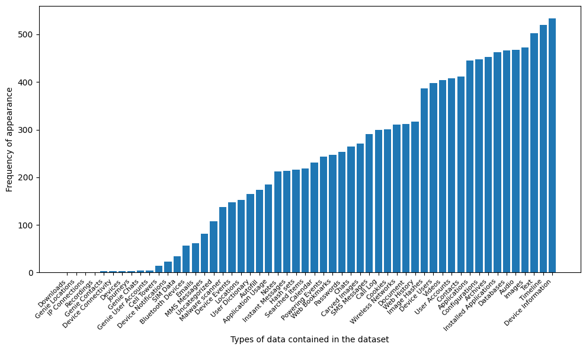
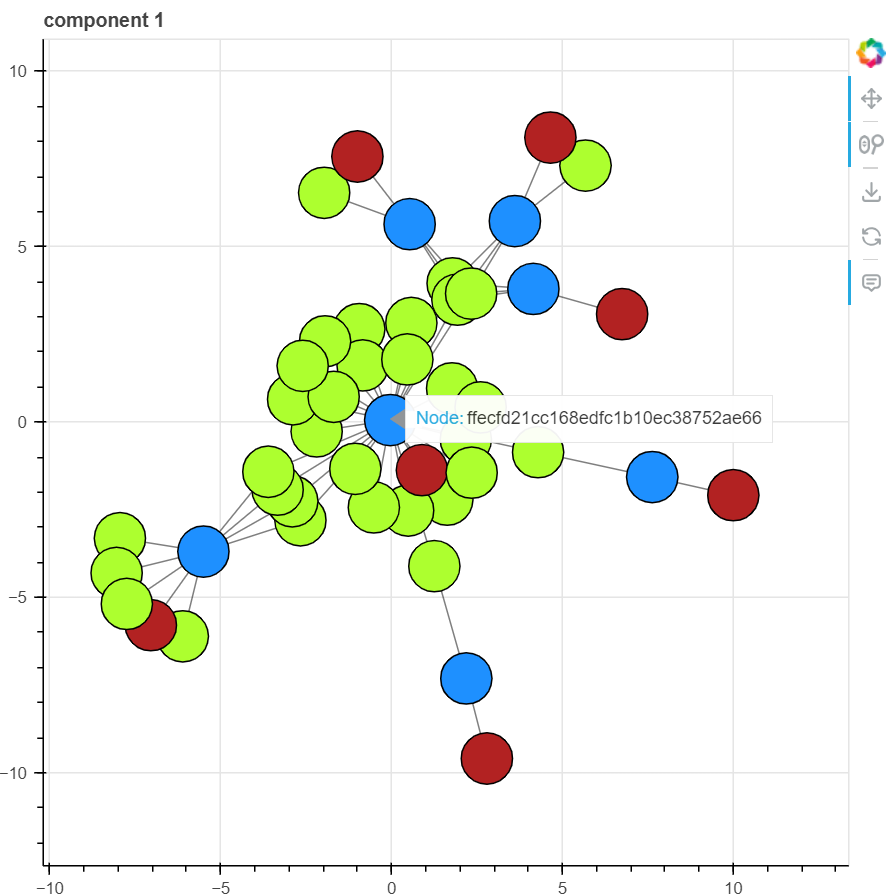
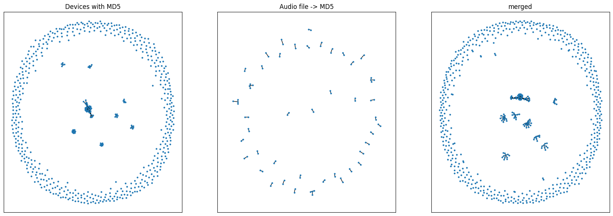

# Data Challenge 2024 - Visualizing Common Media Files

## Project Name
Visualized Networks of Media Files.

## Description
This project is part of a data challenge. It is based off of a dataset containing some phone records in excel spreadsheets (raw data), .json files (parsed data), and a subset of media files. Our goal was to connect the media files to their original devices.

## Visuals
Bar Chart:

Bokeh Plot:

NetworkX Plot:

## Installation
Users should install the requirements from the given [text file](requirements.txt) and reinitialze file paths to where their data is stored on their end (this is located in the 2nd cell of [Visuals_Notebook.ipynb](James_Code/Visuals_Notebook.ipynb)).

## Discoveries
During out experiments, we first went to process the data from the excel files. We found the most common sheetnames contained in all the excel files, which included 'Audio' in the top 5 most frequent. 

It is important to note that we hypothesize that each excel/json file pertains to a specific device. Since we can map any file to an MD5 hash value, and some MD5 hash values were scimmed from devices with Audio files, we set out to build a visual network connecting media files to their original device via the common MD5 hash values. In the end, we were able to determine that some devices did indeed share media files. 

In the bokeh graphs (the interactive plots): 
- Common hash values linking devices to media files are BLUE
- Devices are GREEN
- titles of the media files are RED

## What can we add?
- Additional media files were present in the dataset (e.g. images and documents) which should be added to the network
- It is also possible to parse through the contacts and call logs to add yet another component to the networks.
- The GREEN nodes should be relabeled based on their device (type, name, IMEI,etc.)

## Project status
The time for this project has concluded.
